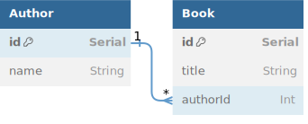

# Prisma - Intro

This activity guides you through building a simple CRUD API using Prisma and Express. It requires a basic understanding of relational database schemas, how to translate them into the equivalent [Prisma schemas](https://www.prisma.io/docs/concepts/components/prisma-schema), and how to [perform CRUD operations with Prisma Client](https://www.prisma.io/docs/concepts/components/prisma-client/crud).

The **solution** branch contains documented solution code. The commit history of that branch follows the instructions below.

## Overview

1. Define Prisma schema according to the provided database schema.
1. Write a seed script to initialize the database with Prisma Migrate.
1. Write Express routes that perform CRUD operations via Prisma Client.

## Database Schema



<details>
<summary>Expand to see DBML</summary>

```dbml
Table Author {
  id Serial [pk]
  name String
}

Table Book {
  id Serial [pk]
  title String
  authorId Int
}

Ref: "Book"."authorId" > "Author"."id"
```

</details>

## Instructions

### Initialize the Database

1. Fork and clone this repo. Work in your local repository!
1. Install the Prisma CLI.\
   `npm install prisma --save-dev`
1. Initialize Prisma to use sqlite.\
   `npx prisma init --datasource-provider sqlite`
1. In the generated `.env` file, set `DATABASE_URL` to `"file:books.db"`.
1. Add models to your `schema.prisma` file according to the database schema above.
1. Create and run the initial migration.\
   `npx prisma migrate dev --name init`
1. Explore the created database. You should see two empty models: `Author` and `Book`.\
   `npx prisma studio`
1. If you made a mistake in your `schema.prisma`, instead of running another migration, you can instead use [`db push`](https://www.prisma.io/docs/guides/migrate/prototyping-schema-db-push) to sync your database with the schema. This is useful while _prototyping_.\
   `npx prisma db push`

### Seed the Database

1. Install Prisma Client, which we will use to interact with the database.\
   `npm install @prisma/client`
1. Create and export a new `PrismaClient` in `prisma/index.js`.
   ```js
   const { PrismaClient } = require('@prisma/client');
   const prisma = new PrismaClient();
   module.exports = prisma;
   ```
1. In `prisma/seed.js`, seed 20 authors into the database. Each author should have 3 corresponding books. Refer to [the docs on how to create related records](https://www.prisma.io/docs/concepts/components/prisma-client/relation-queries#create-a-related-record).
   ```js
   const prisma = require('../prisma');
   const seed = async () => {
     // TODO: Create 20 authors with 3 books each
   };
   seed()
     .then(async () => await prisma.$disconnect())
     .catch(async (e) => {
       console.error(e);
       await prisma.$disconnect();
       process.exit(1);
     });
   ```
1. Update `package.json` to configure Prisma's integrated seeding functionality.
   ```json
   "prisma": {
     "seed": "node prisma/seed.js"
   }
   ```
1. Use Prisma Migrate to completely reset and seed the database.\
   `npx prisma migrate reset`
   - Note: this is designed to be used in _development_ only! Another option is `npx prisma db seed`, but that will not clear existing data. `reset` is simpler to use (for now).
1. Confirm that the database is correctly seeded with authors and books.\
   `npx prisma studio`

### Serve the Data with Express

1. Install Express and create a server with two main routers: `/authors` and `/books`.
1. Create the following `/authors` routes. These routes should use the [Prisma Client CRUD operations](https://www.prisma.io/docs/concepts/components/prisma-client/crud) to read and write from the database.
   - `GET /authors` - returns an array of all authors
   - `POST /authors` - creates a new author with the information provided in the request body
   - `GET /authors/:id` - returns a single author with the specified id
   - `PUT /authors/:id` - overwrites the author with the information provided in the request body
   - `DELETE /authors/:id` - deletes the author with the specified id
1. Add the following `/authors` routes; these routes handle the relationship between authors and books.
   - `GET /authors/:id/books` - get all books written by the specified author
   - `POST /authors/:id/books` - creates a new book as provided in the request body with the specified author
1. Create the following `/books` routes.
   - `GET /books` - returns an array of all books
   - `GET /books/:id` - returns a single book with the specified id
   - `PUT /books/:id` - overwrites the book with the information provided in the request body
   - `DELETE /books/:id` - deletes the book with the specified id

You now have a fully working CRUD API!
